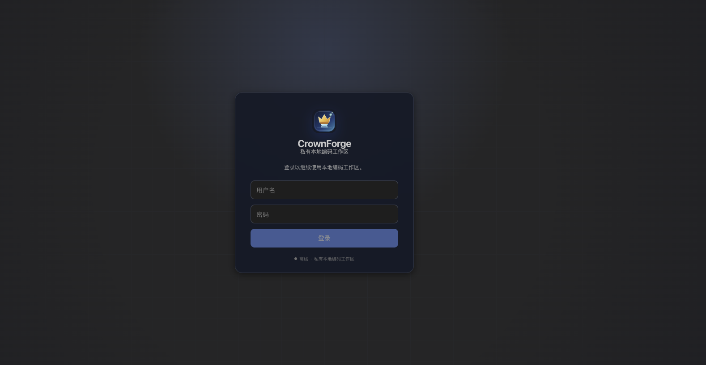
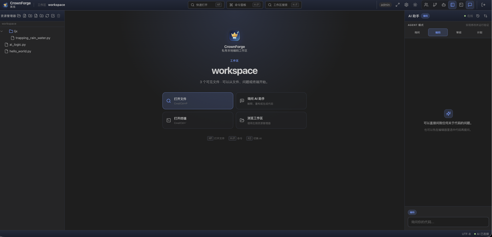

# CrownForge

<p align="center">
  
</p>

> Current Version: `v1.0.0`
>
> Release Date: `2026-08-13`

CrownForge is a self-hosted, web-based AI coding workspace featuring a code editor, integrated terminal, Rolex Agent, and multi-agent collaboration. The supplied deployment can run in a single Docker container.

**Offline-capable when every configured dependency is local.** Local OpenAI-compatible models such as vLLM, Ollama, or LocalAI can keep model traffic on your network. Hosted models, MCP servers, Git providers, delivery webhooks, and update sources require network and may transmit the data you explicitly configure them to receive. See the [operator runbook](docs/operations/operator-runbook.md) and [release evidence matrix](docs/verification/release-evidence.md) for tested boundaries.

[中文文档](README_zh.md)




## Release Notes

### v1.0.0 · 2026-08-13

- Added explicit **Direct Code and Plan-bound Code execution contracts**, durable plan amendments, mutation evidence, and deterministic completion gates so a run cannot report success while required checks, active descendants, or recorded changes remain unresolved
- Upgraded recovery to an incremental **checkpoint and mutation journal** model with selective file/hunk rollback, manual-edit conflict detection, corrupt-journal fail-closed behavior, and visible `needs_attention` recovery states
- Moved mutating child agents into isolated Git worktrees and introduced integrity-bound **ChangeSet v3** capture, independent review revisions, transition CAS, write-ahead integration recovery, fenced cross-process locks, and safe apply/merge/cherry-pick policies
- Added real **process, filesystem, network, and secret isolation** for Agent and extension commands using macOS Seatbelt or Linux bubblewrap when available, with capability probing and fail-closed behavior when the required boundary cannot be established
- Made multi-agent execution durable with persisted runs, lineage, leases, task ownership, message delivery, restart recovery, recursive descendant completion checks, bounded trace retention, and independent Reviewer/Verifier evidence
- Added offline incremental **repository intelligence** with symbol/reference indexing, permission-aware retrieval, context manifests, provenance, deterministic evaluation, and performance budgets
- Completed the Git delivery loop across local branches, commits, GitHub/GitLab/Gitea PR or MR delivery, CI status, structured findings, webhook feedback, SARIF, and deterministic offline evidence bundles
- Unified hooks, policy-as-code, skills, plugins, provider routing, model budgets, fallback classification, conflict-aware human editing, and secret-safe operational telemetry behind explicit governance surfaces
- Finished the Workbench recovery and review experience with keyboard/ARIA contracts, responsive states, English/Chinese parity, safe external links, migration inventory, operator documentation, and legacy ChangeSet read-only handling
- Replaced best-effort release checks with an exact clean-snapshot gate covering recursively discovered tests, mandatory no-skip security/recovery suites, strict unused TypeScript checks, offline network auditing, frontend contracts, bundle budget, trace overflow, performance, and 100-run stability loops

### v0.9.0 · 2026-08-04

- Introduced the updated **chat-first and editor-first Workbench** with a dedicated 400px editor collaboration rail, configured model selection, real Agent run events, elapsed time, expandable steps, stop/resume/rerun controls, and active-file context that follows the editor
- Kept the selected **Ask / Plan / Code / Review mode** stable across requests so a Code task no longer falls back to Plan before the Agent can operate
- Added server-validated **per-run model selection** from administrator-configured models and persisted the effective model in run history and live run state
- Expanded Explorer search to combine **file-name/path matching with file-content search**, including debounced ripgrep results, match counts, loading feedback, and workspace-boundary enforcement
- Added Explorer **copy path, copy/paste, and drag-to-move** workflows for files and folders, while folder selection now starts at each user's own workspace root instead of the global `/workspace`
- Restored **side-by-side file comparison** with a visible file picker, synchronized scrolling toggle, read-only reference pane, and responsive vertical layout on narrow screens
- Surfaced pending **tool approvals inside the editor collaboration rail** and automatically opens that rail when an Agent is blocked waiting for input; the full chat and editor views share the same approval queue and decisions
- Added confirmed **conversation deletion** to both task-history surfaces, with active-run protection and safe reset when the current conversation is removed; deleting chat history never reverts workspace changes
- Refined UI interaction design, accessibility labels, compact responsive controls, Chinese/English copy, and regression contracts around comparison, approval continuity, and conversation lifecycle; current accessibility/i18n/responsive release limits are recorded in the evidence matrix
- Expanded the repeatable verification suite across the complete discovered backend test set, backend/frontend typechecks, production build, JSON hierarchy tests, context benchmark, UI contracts, and whitespace validation

### v0.8.0 · 2026-07-25

- Added automatic **pre-code workspace checkpoints** and a Checkpoints panel with manual snapshots, explicit restore confirmation, workspace refresh, and safe editor-state cleanup after recovery
- Added permission-aware **tool approval** for file writes and shell execution, including one-time decisions, session-scoped directory trust for file tools, and hard safety-policy blocks for protected metadata, credentials, destructive commands, and workspace escapes
- Added a unified **Problems** surface that combines Monaco markers with persistent TypeScript, Ruff, and Cargo diagnostics, supports severity filtering, and navigates directly to file locations
- Added an allowlisted, cancellable **Run & Test Center** with live output, duration and status history, parsed failure locations, timeout/cancellation states, and direct editor navigation
- Expanded **Run & Debug** to support both Node Inspector and Python `debugpy`/DAP, with workspace breakpoints, pause/continue, step controls, call-stack frames, runtime labels, actionable startup errors, and explicit session lifecycle states
- Added a stable **Change Summary** bridge across AI results, structured review findings, Git changes, Monaco Diff, editor locations, conflict groups, and keyboard-accessible file tabs
- Standardized Agent, Team, Terminal, and utility-panel behavior with shared panel chrome, responsive single-drawer layouts, focus return, reconnect actions, narrow-screen command access, and reduced-motion handling
- Upgraded the builtin **JSON Visualizer** to **JSON Parser**, supporting searchable hierarchy editing, object-key rename, object/array child insertion, primitive value editing, confirmed deletion, duplicate-key/number validation, and local undo/redo
- Added the permission-gated `editor.modify` plugin capability so preview plugins only receive editor write-back access when explicitly declared; team viewer roles remain read-only
- Added repeatable JSON mutation tests, expanded backend/UI contracts, visual regression baselines, and production verification across backend tests, typechecks, frontend builds, UI contracts, and whitespace checks

### v0.7.0 · 2026-07-14

- Completed the **CrownForge Workbench frontend redesign** across the task-first AI panel, editor canvas, panel surfaces, responsive drawers, and settings / terminal / knowledge experiences
- Added `TaskHeader` and `ContextStrip` so mode, run state, context budget, MCP health, and Memory / Skills state are readable at a glance
- Added per-file Monaco **view-state restoration** so switching tabs preserves scroll position, cursor, selection, and folding state
- Standardized Git, Agent, Team, Terminal, Settings, and Knowledge surfaces with shared `PanelShell` styling, clear loading / empty / error states, and responsive behavior
- Added static UI contract coverage for Tab / Command Palette / Search / Dialog flows, focus styles, dialog semantics, narrow-screen controls, and reduced motion; live keyboard and assistive-technology behavior remains gated by the release evidence matrix
- Added a repeatable **UI Contract** check to `scripts/verify.sh` covering responsive breakpoints, focus states, dialog semantics, `PanelShell`, and reduced-motion support
- Increased the Workbench typography baseline and normalized panel, status, and metadata sizing for better readability on remote browser sessions
- Reworked the **Explorer** with a visible workspace identity card, inline file filtering, file/folder counts, grouped creation actions, keyboard-accessible tree items, and clearer empty / no-match states
- Added a builtin **JSON Visualizer** with searchable and collapsible trees, node statistics, JSONPath/value copy actions, invalid-file feedback, and full light/dark theme support
- Aligned the live React Workbench with the approved `workbench.html` baseline at 1440×900: a 52px header, 52px activity rail, 272px Explorer, 380px Task Dock, and 26px status bar, while keeping authentication, file, command, Git, Agent, Team, terminal, settings, and chat flows reachable

### v0.6.1 · 2026-07-14

- Added Codex-inspired **agent context management** with automatic micro-compaction, explicit `/compress` support, context status events, safe transcript trimming, and preserved run transcripts under `.transcripts/`
- Added configurable **external MCP connectivity** through HTTP / SSE JSON-RPC endpoints, including endpoint inspection, tool discovery, scoped tool names, timeout controls, and graceful offline fallback
- Added MCP **lazy loading** with `eager`, `lazy`, and `disabled` endpoint modes; lazy endpoints expose search and activation controls first, loading only selected tool schemas into the next reasoning round to reduce context pressure
- Added persistent **workspace and user memory** under `.codex/USER.md` and `.codex/MEMORY.md`, with `memory_read` / `memory_write` tools and memory context injected into new agent runs
- Added reusable **workspace skills** discovered from `.codex/skills/*/SKILL.md` and `skills/*/SKILL.md`, with metadata-only catalog loading and on-demand `skill_load`
- Added admin **Memory Management** for editing, clearing, and merging user/workspace memory files without leaving the Settings flow
- Added admin **Skills Management** for searching, previewing metadata and instructions, enabling/disabling workflows, and reviewing skill run history
- Added MCP, memory, skills, and context regression tests, plus matching admin settings, environment variables, status events, and documentation

### v0.6.0 · 2026-07-12

- Added a Codex-inspired **workspace shell** with grouped top-bar controls, workspace welcome state, focus mode, command palette, workspace search, responsive drawers, and reduced-motion support
- Added clearer **Ask / Code / Review / Plan** task workflows with current-mode context, mode descriptions, running stop control, completion status, empty states, composer context, and clickable changed-file links
- Added stronger **editor and review context** with file breadcrumbs, accessible tab metadata, unsaved/remote-update indicators, Git change summaries and status badges, improved Diff actions, and direct file navigation from review results
- Unified the **Team / Agent / Terminal** panel states with agent progress summaries, terminal connection status, mobile drawer scrim and close behavior, and keyboard/focus accessibility refinements
- Refined light/dark **visual tokens**, panel headers, scrollbars, login surface, form focus states, and local workspace status presentation
- Rebranded the product as **CrownForge**, added a unified brand constant, and replaced the former logo with a native SVG mark pairing a crown, forge, and spark motif
- Added [`DESIGN.md`](DESIGN.md) as the UI/UX design source of truth and implementation roadmap

### v0.5.1 · 2026-07-09

- Added direct **file and folder upload** from the file explorer using multipart form uploads, including overwrite conflict handling without base64 payloads
- Added an admin-managed **upload max file size** setting; admins can change the per-file upload limit from **Settings**, with `UPLOAD_MAX_FILE_SIZE_MB` available as the environment fallback
- Added selectable **editor fonts** in **Settings**, persisted per browser session so users can choose a more comfortable coding font
- Added per-file **editor view-state restore** so reopening a previously opened tab returns to the last cursor/scroll position
- Added explicit AI **Stop** and **Correct current run** controls so users can interrupt an active run or steer it while tools are executing
- Documented the existing **Markdown rendering**, light/dark theme switching, and custom system prompt settings as first-class user-facing features

### v0.5.0 · 2026-05-12

- Added **interruptible agent steering** with a follow-up queue: users can append corrective instructions while the AI is running, the agent checks for steering immediately after each tool result, interrupts the remaining tool batch, and starts the next turn with prior tool results preserved in context
- Added a **configurable max agent iteration limit** in the in-app **Settings** panel so administrators no longer need to hardcode the inner-loop limit in environment variables
- Added **workspace auto-refresh** for editor/file changes, plus a manual **Refresh** button in the file tree and a cleaner **on-demand multi-select** flow instead of always-visible checkboxes
- Added a practical **team collaboration MVP** with team create/join/switch flows, invite codes with selectable roles, owner/admin/member/viewer permissions, presence, file claims, shared workspace sync, role management, owner transfer, remove-member, and leave-team actions
- Added **collaboration-safe saving** with read-only viewer enforcement, claim conflict warnings, save-time version validation, remote change source labels (`team_member`, `external`, `assistant_tool`, `unknown`), and a conflict dialog that supports block/hunk merges plus one-click **Use All Remote** / **Keep All Local** actions

### v0.4.0 · 2026-04-24

- Added a lightweight **plugin system** with builtin and external plugins, offline installation from the local `plugins/` directory, permissions/scopes, and an in-app plugin manager
- Moved **Monaco highlighting** and **chat Markdown rendering** into builtin plugins, and shipped **Markdown file preview** as a real external sample plugin under `plugins/markdown-file-preview`
- Added builtin **interface localization** with English / Simplified Chinese switching in Settings, plus dark-theme-aware Monaco editor theming
- Added per-workspace **chat history persistence** under `.history/`, including history browsing, continue-chat support, LLM-generated conversation titles, and automatic pruning to the 5 most recent conversations

### v0.3.2 · 2026-04-24

- Expanded **Python semantic highlighting** with multi-line assignment targets, `with` aliases, `for` targets, `lambda` parameters, comprehension bindings, `global` / `nonlocal`, and `except*` aliases
- Refined **TypeScript / React / Vue** editor highlighting by expanding Monaco token theme coverage for semantic token types and embedded component syntax
- Added manual editor regression samples under [`docs/editor-samples/`](docs/editor-samples/README.md) for Python, TypeScript, React, and Vue

### v0.3.1 · 2026-04-23

- Extended **Ctrl/Cmd + left click** navigation with a workspace-aware definition lookup path, improving symbol jumps for Python, Vue, React, and other cross-file flows
- Added **Max Tokens** to the in-app **Admin Settings** panel so administrators can manage request limits without editing environment variables
- Fixed an editor regression where **Ctrl/Cmd + S** could save stale content because Monaco actions were holding outdated callbacks

### v0.3.0 · 2026-04-22

- Added an in-app **Admin Settings** panel for creating users, deleting users, resetting passwords, and updating the LLM endpoint / API key / model without restarting the service
- Added **file and folder downloads** from the left file tree; folders are streamed as `.zip`
- Added **batch delete** in the file tree with multi-select support
- Added **Ctrl/Cmd + left click** code navigation in the editor for jumping to symbol definitions within the current file and already-open tabs
- Fixed the **Copy** action on AI code blocks with a clipboard fallback for environments where `navigator.clipboard` is unavailable

## Versioning

This repository now documents releases in a lightweight GitHub-style changelog format.
`v1.0.0` is the current documented release. It turns the editor-first collaboration workflow into a verifiable delivery system: execution contracts, isolated worktrees, integrity-bound ChangeSets, durable multi-agent recovery, repository intelligence, provider-neutral delivery, governed extensions, migration contracts, and mandatory release evidence now form one end-to-end path.

Operator and release documentation:

- [Operator runbook](docs/operations/operator-runbook.md) — backup/restore, retention, sandbox limits, integrations, secrets and incident recovery
- [Storage migrations](docs/migrations/storage-migrations.md) — format inventory, compatibility, automatic backup boundaries and downgrade
- [Claim-to-verification matrix](docs/verification/release-evidence.md) — test/script evidence and platform-conditional limitations

## Workbench Design Baseline

The live frontend uses the approved `workbench.html` visual reference for the desktop workbench. At the 1440×900 acceptance viewport, the shell is organized as:

- **Workspace Header** — CrownForge identity, workspace path, active task, command palette, panel toggles, and a compact user menu
- **Activity Rail** — Explorer, Changes, Agents, Terminal, and Settings with low-noise active states
- **Editor Canvas** — tabs, breadcrumbs, Monaco or file preview, and the primary code workspace
- **Task Dock** — task title, Ask / Code / Review / Plan modes, Context / MCP / Memory / Skills status, messages, run evidence, and composer
- **Status Bar** — connection, branch, change, cursor, language, and background task metadata

The implementation keeps real workspace data and existing interaction flows behind this shell; the reference file supplies layout, hierarchy, spacing, and visual density rather than mock content.

## Features

- **Offline-Capable & Self-Hosted** — Can operate without public internet when the model, MCP services and dependencies are local and external provider delivery is disabled; hosted endpoints and Git providers still require approved network access
- **Codex-Inspired Workspace UI** — Grouped workspace controls, focused task workflows, command palette and search, responsive side panels, clear status surfaces, light/dark visual tokens, and keyboard-friendly interactions
- **OpenAI-Compatible API** — Works with vLLM, Ollama, LocalAI, DeepSeek, OpenAI, or any OpenAI-compatible LLM endpoint — swap models without changing code
- **Monaco Code Editor** — Full-featured editor with syntax highlighting, deeper Python semantic highlighting, richer TypeScript/React/Vue token coloring, IntelliSense, multi-tab support, selectable editor fonts, per-file cursor/scroll restore, reliable Ctrl/Cmd-click symbol navigation, synchronized side-by-side file comparison, collaboration notices, and safer save behavior with version-aware conflict handling
- **Markdown Rendering** — AI chat responses render Markdown through the builtin plugin system, and Markdown files can be previewed with the shipped external preview plugin
- **JSON Parser** — JSON files open in a builtin searchable hierarchy editor with statistics, expand/collapse controls, JSONPath/value copy actions, reversible add/edit/rename/delete operations, validation, read-only enforcement, and clear parse-error feedback
- **Checkpoints & Recovery** — Code tasks create a workspace checkpoint before tool execution; users can also create, inspect, and explicitly restore snapshots from the Checkpoints panel
- **Integrity-Bound ChangeSets** — Mutating child agents work in isolated Git worktrees and return schema-v3 ChangeSets whose capture metadata, patch content, review revision, transition state, integration WAL, and recovery outcome are verified before integration
- **Deterministic Completion Evidence** — Runs remain incomplete while required checks, mutation-evidence gaps, unresolved review findings, active descendants, or recovery-required ChangeSets remain; completion evidence is persisted for later inspection
- **Agent Sandbox** — Agent and extension commands use platform isolation, explicit path grants, network policy, resource limits, secret redaction, and descendant-process supervision, failing closed when a promised boundary is unavailable
- **Problems & Diagnostics** — Monaco markers and persistent TypeScript/Ruff/Cargo checks share one filterable Problems surface with direct file/line navigation
- **Run, Test & Debug** — Discover allowlisted project tasks, stream and cancel executions, navigate parsed failures, and debug Node.js or Python programs with breakpoints, stepping, runtime-aware status, and call stacks
- **Tool Approval & Safety Policy** — Side-effecting file and shell tools pause for an explicit decision in both the full chat and editor collaboration rail, while protected metadata, secrets, destructive commands, and workspace escapes remain non-bypassable
- **Structured Review & Diff** — AI review findings, changed-file summaries, Git groups, conflict states, and Monaco Diff share a consistent navigation path back to the editor
- **Light / Dark Theme** — Users can switch the UI theme from the title bar; the selected theme is persisted locally and keeps Monaco in sync
- **Plugin System** — VS Code-style lightweight plugin mode with builtin and external plugins, explicit permissions/scopes, offline install from `plugins/`, an in-app plugin manager, and a shipped Markdown preview example plugin
- **AI Coding Assistant** — Powered by **Rolex Agent**, it can read, write, edit files, and run shell commands in your workspace, supports Ask / Code / Review / Plan modes, interruptible steering, automatic context compaction with preserved `.transcripts/`, lazy-loaded external MCP tools, and honors team read-only roles
- **Persistent Agent Context** — Workspace-local `.codex/USER.md` and `.codex/MEMORY.md` are loaded into new agent runs, while reusable `.codex/skills/*/SKILL.md` workflows are catalogued and can be loaded on demand
- **Persistent Chat History** — Each workspace stores conversation history in `.history/` as `.jsonl` files, supports continue-chat and confirmed deletion flows, protects active runs, and keeps the 30 most recent conversations
- **Integrated Terminal** — Full PTY terminal (xterm.js) with connection status, responsive panel behavior, Conda pre-installed, automatic `base` activation, Ruff diagnostics, and Python document formatting
- **File Explorer** — Tree-view file browser with create, rename, copy path, copy/paste, drag-to-move, file/folder upload, download, batch delete, folder-as-zip download, combined name/content search, auto refresh, and session-isolated "Open Folder" switching rooted at the current user's own workspace
- **Admin Settings Panel** — Manage users, reset passwords, update the LLM URL / API key / model / max agent iterations / system prompt / upload size limit / MCP endpoints from the UI, automatically detect the model output-token limit, and switch interface language between English and Simplified Chinese
- **Multi-User Auth** — Local username/password login backed by `users.json`, with self-service registration and administrator approval; every approved login gets an isolated session, workspace, terminal, and AI context
- **Team Collaboration** — Create/join teams on a shared workspace, invite members with owner/admin/member/viewer roles, see presence and active-file status, claim files, review activity, and coordinate conflict-safe saves through a clearer collaboration panel
- **Multi-Agent Collaboration** — Spawn autonomous AI teammates that can claim tasks, communicate via message bus, work in parallel, and expose live progress summaries
- **Durable Multi-Agent Control Plane** — Agent runs, tasks, leases, lineage, messages, traces, findings, budgets, and recovery state survive restarts; parent completion recursively waits for terminal descendants and independent review evidence
- **Repository Intelligence** — Incremental offline indexing, symbol/reference relationships, permission-aware retrieval, context manifests, and provenance help agents assemble reproducible context without leaking forbidden paths
- **Git & Review Delivery** — Local branch/commit workflows, provider-neutral GitHub/GitLab/Gitea delivery, CI status, webhook feedback, structured findings, SARIF, and offline evidence bundles preserve the exact reviewed revision
- **Governed Extensions & Models** — Hooks, policies, skills, plugins, provider conformance, model budgets, and classified fallbacks share explicit permissions, audit trails, and operator-visible failure states
- **Task Board** — Create, assign, and track tasks across agents with clearer workspace status and task-oriented UI context
- **Docker Ready** — Multi-stage Dockerfile with Node.js, Python, Conda, Git, and common dev tools pre-installed

## Quick Start

### Docker (Recommended)

```bash
docker build -t ai-ide .

docker run -d --name ai-ide \
  -p 3000:3000 \
  --user 0:0 \
  --read-only \
  --tmpfs /tmp:rw,noexec,nosuid,size=64m,mode=1777 \
  --security-opt no-new-privileges:true \
  --cap-drop ALL \
  --cap-add CHOWN \
  --cap-add SETGID \
  --cap-add SETUID \
  -v ./workspace:/workspace \
  -v ./plugins:/app/plugins \
  -v ai-ide-config:/app/config \
  -e VLLM_API_URL=http://your-llm-server:8000/v1 \
  -e VLLM_API_KEY=your-api-key \
  -e MODEL_NAME=your-model-name \
  ai-ide
```

The image installs `debugpy` for Python debugging and Ruff for Python
diagnostics and formatting. The Dockerfile selects the Ruff `0.15.22` Linux
wheel for x86_64 or ARM64, downloads it directly from the official PyPI file
host, verifies its SHA-256 digest, and installs it with `--no-index`. This avoids
committing large wheel files and does not depend on Ruff being mirrored by the
configured Python package index.

```bash
docker build -t ai-ide .
# or
docker compose build
```

Open a Python file and use **Format Python Document** from the command palette,
the editor context menu, or press `Shift+Alt+F`. Formatting runs against the
unsaved editor content, honors the workspace's `pyproject.toml` / `ruff.toml`,
and remains undoable before saving.

`debugpy` is still installed from `requirements.txt`. For an internal Python
package mirror, pass its URL as a build argument (do not embed credentials in
the Dockerfile or commit them):

```bash
docker build \
  --build-arg PIP_INDEX_URL=http://pypi.example.local/simple \
  --build-arg PIP_TRUSTED_HOST=pypi.example.local \
  -t ai-ide .
```

### Verification

The repository includes repeatable local checks for the Agent harness, collaboration safety boundaries, release methodology, and deployment image:

```bash
./scripts/verify.sh
./scripts/docker-smoke.sh
```

`verify.sh` runs the exact clean-snapshot release workflow. It recursively discovers backend tests, enforces mandatory no-skip security and migration/recovery suites, runs backend/frontend strict unused TypeScript checks, validates browserless UI and workflow contracts, audits offline network access, measures retrieval/trace/overflow performance, enforces the frontend bundle budget, executes 100-run critical and soak loops, and verifies that the source inventory did not change during validation. `docker-smoke.sh` builds the image, starts a disposable hardened container, checks `/api/health` and Docker health, verifies the served CrownForge shell, and confirms it runs unprivileged with writable workspace/config mounts only. Override `CROWNFORGE_SMOKE_PORT` or `CROWNFORGE_SMOKE_IMAGE` when the defaults are occupied.

Or use Docker Compose:

```bash
# Edit docker-compose.yml with your LLM endpoint
docker compose up -d
# Legacy Compose v1 uses: docker-compose up -d --build
```

The checked-in Compose file intentionally avoids v2-only `build.pull` and
`pull_policy` keys, so it can be parsed by both `docker-compose` v1 and
`docker compose` v2. Builds reuse locally available base images by default;
run `docker compose build --pull` (or `docker-compose build --pull`) only when
you explicitly want to refresh them.

Then open http://localhost:3000 and log in.
Sign in as an admin user and use the top-right **Settings** button to manage users and configure the LLM endpoint.

### Docker Compose

```yaml
services:
  crownforge-permissions:
    image: ai-ide:latest
    command: ["init-mounts"]
    user: "0:0"
    volumes:
      - ./workspace:/workspace
      - ./plugins:/app/plugins
      - crewforge-config:/app/config
    read_only: true
    security_opt:
      - no-new-privileges:true
    cap_drop:
      - ALL
    cap_add:
      - CHOWN
    environment:
      - CROWNFORGE_UID=10001
      - CROWNFORGE_GID=10001
    restart: "no"

  ai-ide:
    build: .
    ports:
      - "3000:3000"
    volumes:
      - ./workspace:/workspace
      - ./plugins:/app/plugins
      - crewforge-config:/app/config  # persist users and admin settings
    user: "10001:10001"
    depends_on:
      - crownforge-permissions
    read_only: true
    tmpfs:
      - /tmp:rw,noexec,nosuid,size=64m,mode=1777
    security_opt:
      - no-new-privileges:true
    cap_drop:
      - ALL
    environment:
      - VLLM_API_URL=http://host.docker.internal:8000/v1
      - VLLM_API_KEY=
      - MODEL_NAME=default
      - WORKSPACE_DIR=/workspace
      - CROWNFORGE_UID=10001
      - CROWNFORGE_GID=10001
      - MAX_AGENT_ITERATIONS=30
      - AGENT_MAX_TOKENS=8192
      - AGENT_CONTEXT_COMPACT_THRESHOLD=60000
      - MCP_BASE_URLS=
      - MCP_LAZY_URLS=
      - MCP_DISABLED_URLS=
      - MCP_TIMEOUT=60
      - MCP_CONNECT_TIMEOUT=10
      - UPLOAD_MAX_FILE_SIZE_MB=250
    restart: unless-stopped
    extra_hosts:
      - "host.docker.internal:host-gateway"
volumes:
  crewforge-config:
```

The container service account defaults to UID/GID `10001`. Compose first runs a
short-lived `crownforge-permissions` service with only `CHOWN`, then starts the
main service as the configured non-root account with all capabilities dropped.
Fresh deployments therefore do not need manual `mkdir`, `chmod`, or `chown`
commands. The initializer also repairs ownership recursively for files left by
older root-running releases, so Code mode can update existing workspace files.
The direct `docker run` example performs the same initialization in
its entrypoint and drops to the configured account before Node starts. Set
`CROWNFORGE_UID` and `CROWNFORGE_GID` when bind mounts should match a specific
host account. Local `npm run dev` is unchanged.

Docker backend dependencies are installed through `https://registry.npmmirror.com`
by default so mixed registry URLs in the lockfile do not require access to
`registry.npmjs.org`. Set `NPM_REGISTRY` to an internal or alternative npm
registry before running Compose when your deployment uses a different mirror.

Linux images include `bubblewrap`. Approved agent shell processes are launched
with `bwrap --die-with-parent --unshare-net`, so they can execute local tools but
cannot use the parent server's network namespace; the CrownForge server itself
retains network access for model and MCP connections. This requires unprivileged
user namespaces to be available to UID 10001. You can verify the host/runtime
combination with `docker compose exec ai-ide bwrap --unshare-net -- /bin/true`.
If Docker's seccomp, user-namespace policy, or the host kernel rejects that probe,
CrownForge fails agent shell execution closed. Do not add `SYS_ADMIN`, disable
seccomp globally, or run the service as root to make the probe pass; keep agent
shell disabled for that deployment or enable unprivileged user namespaces through
the host's narrowly scoped container policy.

### Local Development

```bash
# Python debug adapter (once per development environment)
python3 -m pip install -r requirements.txt

# Backend
cd backend
npm install
WORKSPACE_DIR=../workspace npm run dev

# Frontend (in another terminal)
cd frontend
npm install
npm run dev
```

Open http://localhost:5173 (Vite dev server proxies API requests to the backend).

In local development, admin-managed LLM settings are persisted to `app-settings.json` at the project root by default.
`users.json` is also auto-detected from the project root by default, and each workspace stores its own chat history under `<workspace>/.history/`.

### Agent Workspace Shortcuts

- `Cmd/Ctrl+P` — Quick Open files
- `Cmd/Ctrl+Shift+P` — Command Palette
- `Cmd/Ctrl+Shift+F` — Search the workspace
- `Cmd/Ctrl+Alt+N` — Start a new task
- `Cmd/Ctrl+Alt+←/→` — Switch between task threads
- `Cmd/Ctrl+B` / `Cmd/Ctrl+J` / `Cmd/Ctrl+backtick` — Toggle Explorer / AI Assistant / Terminal
- `Cmd/Ctrl+K` — Toggle focus mode

Workspace search runs locally through the ripgrep binary bundled in the Docker
image, so it does not require network access at runtime. It supports regular
expressions, case and whole-word matching, include/exclude globs, ignore files,
and folder-scoped search from the Explorer context menu.

The Command Palette also opens Settings, MCP health, Memory/Skills management, Git changes, Checkpoints, Problems, Run/Test, Run/Debug, and the Agent Board. The MCP and Memory/Skills status chips in the Chat header are clickable shortcuts to their management surfaces.

### Editor Highlighting Samples

Open the files under [`docs/editor-samples/`](docs/editor-samples/README.md) in the IDE when you want a quick manual regression pass for editor highlighting. The sample set currently covers Python semantic bindings, TypeScript semantics, React TSX, and Vue `<script setup lang="ts">` flows.

### Plugin System

The frontend now supports a lightweight plugin architecture inspired by VS Code:

- Builtin plugins ship inside the app bundle and can be enabled/disabled from Settings
- External plugins are discovered from the local `plugins/` directory and installed fully offline
- Plugins declare explicit permissions and derived scopes before activation
- Editor highlighting, chat Markdown rendering, and JSON hierarchy editing are implemented as builtin plugins
- Markdown file preview ships as a working external sample plugin in `plugins/markdown-file-preview/`

Open a Markdown file in the IDE to use the preview toolbar with `Edit`, `Preview`, and `Split` modes.
Open a JSON file to enter the builtin JSON Parser by default. Use node actions to add, edit, rename, or delete hierarchy entries, use local undo/redo for structural changes, and switch the editor toolbar between Edit, Preview, and Split modes. The plugin writes through the editor buffer, so normal dirty-tab, save, conflict, and team read-only rules still apply.
Docker images now also include the shipped `plugins/` directory by default, and the provided `docker-compose.yml` mounts local `./plugins` to `/app/plugins` so external plugins work out of the box.

See [`docs/plugins/README.md`](docs/plugins/README.md) for the plugin manifest format, host APIs, permissions, and offline installation flow.

### Team Collaboration

The IDE now includes a practical shared-team workflow focused on low-friction coordination before full CRDT/OT co-editing:

- Create, join, and switch teams bound to a shared workspace
- Generate invite codes with a selected default role
- Support `owner`, `admin`, `member`, and `viewer` permissions
- Track online presence, active file, and lightweight collaboration activity
- Use soft file claims to reduce collisions before editing
- Enforce read-only access for viewers across editor and AI-assisted file writes
- Broadcast file-tree and file-content refreshes when teammates create, rename, delete, or save files
- Protect saves with version validation, claim conflict warnings, conflict-source labeling, and a diff/merge dialog with per-block and bulk resolution actions

## Configuration

### Environment Variables

| Variable | Default | Description |
|----------|---------|-------------|
| `VLLM_API_URL` | `http://host.docker.internal:8000/v1` | OpenAI-compatible API endpoint |
| `VLLM_API_KEY` | *(empty)* | API key for the LLM endpoint |
| `MODEL_NAME` | `default` | Model name to use |
| `WORKSPACE_DIR` | `/workspace` | Default workspace directory |
| `PYTHON_EXECUTABLE` | `python3` (`python` on Windows) | Fallback Python interpreter for debugging when the workspace has no `.venv` or `venv` interpreter |
| `DEBUGPY_PYTHON_EXECUTABLE` | `PYTHON_EXECUTABLE` | Python interpreter where `debugpy==1.8.21` is installed; the Docker image configures this automatically |
| `PORT` | `3000` | Server port |
| `MAX_AGENT_ITERATIONS` | `30` | Max tool-use rounds per AI response |
| `AGENT_MAX_TOKENS` | `8192` | Legacy fallback only; output-token limits are detected automatically from model metadata when available |
| `AGENT_CONTEXT_COMPACT_THRESHOLD` | `60000` | Estimated context-token threshold that triggers automatic compaction |
| `MCP_BASE_URLS` | *(empty)* | Comma- or newline-separated HTTP/SSE MCP endpoints |
| `MCP_LAZY_URLS` | *(empty)* | Endpoints whose tools are searched and activated on demand |
| `MCP_DISABLED_URLS` | *(empty)* | Endpoints excluded from Agent tool discovery |
| `MCP_TIMEOUT` | `60` | MCP request timeout in seconds |
| `MCP_CONNECT_TIMEOUT` | `10` | MCP connection timeout in seconds |
| `SYSTEM_PROMPT` | *(empty)* | Optional default system prompt override for the AI agent |
| `UPLOAD_MAX_FILE_SIZE_MB` | `250` | Per-file upload limit in MB; can be overridden from admin Settings |
| `USERS_CONFIG` | `/app/config/users.json` in Docker | Path to `users.json` |
| `APP_SETTINGS_CONFIG` | `/app/config/app-settings.json` in Docker | Path to `app-settings.json` for admin-managed LLM settings |
| `TEAM_STORE_ROOT` | `/app/config` in Docker | Root directory containing the process-global `.team/teams.json` index |

### Runtime Settings Files

| File | Purpose |
|------|---------|
| `users.json` | Stores users, passwords, admin flags, and allowed workspace roots |
| `app-settings.json` | Stores admin-managed runtime settings such as LLM configuration, per-agent profiles, MCP servers, plugin overrides, and upload size limits |
| `<workspace>/.history/*.jsonl` | Stores per-workspace chat conversations, generated titles, and message history |
| `<workspace>/.codex/USER.md` | Stores durable user preferences and working conventions |
| `<workspace>/.codex/MEMORY.md` | Stores durable project facts, decisions, and conventions |
| `<workspace>/.codex/skills/*/SKILL.md` | Stores reusable workspace workflows discovered by the Agent |
| `TEAM_STORE_ROOT/.team/teams.json` | Stores the process-global team index: membership, roles, invites, presence, claims, and collaboration activity; this is distinct from workspace-local runtime team state |

If you run with Docker, the Compose config volume persists `users.json`, `app-settings.json`, and `.team/teams.json` across container recreation.
For local development, the default `users.json` and `app-settings.json` locations are the project root.

### User Management

Users can be managed in two ways:

- Preferred: log in as an admin user and open the in-app **Settings** panel to create users, delete users, or reset passwords
- Alternative: edit `users.json` manually at the path pointed to by `USERS_CONFIG` (the Compose named config volume in Docker; the project root for local development)

Example `users.json`:

```json
{
  "allowedRoots": ["/workspace", "/home"],
  "pendingRegistrations": [],
  "users": [
    { "username": "admin", "password": "admin123", "defaultWorkspace": "/workspace", "isAdmin": true },
    { "username": "alice", "password": "securepass", "defaultWorkspace": "/workspace/alice", "isAdmin": false }
  ]
}
```

| Field | Description |
|-------|-------------|
| `allowedRoots` | Directory prefixes users are allowed to open via the folder browser |
| `pendingRegistrations` | Registration requests waiting for administrator approval; managed automatically by CrownForge |
| `username` | Login username |
| `password` | Login password |
| `defaultWorkspace` | The workspace directory opened after login |
| `isAdmin` | Whether the user can open the admin settings panel |

If you edit `users.json` outside the app, restart the backend to reload it. Changes made from the admin settings UI are applied immediately.

Users can open the **Register** tab on the login card and submit a username and password. The request remains local and cannot sign in until an administrator opens **Settings → User Management** and approves it. Approval creates a non-admin account with a default workspace under the first configured `allowedRoots` entry; rejection removes the request.

Every login receives a separate CrownForge session. Switching folders from Explorer only changes that browser session, and immediately resets the open editors and reloads the selected directory's file tree, terminal, conversation context, and Git panel. The directory must already exist and remain within `allowedRoots`.

### LLM Management

LLM runtime settings can be managed in two ways:

- Preferred: use the admin **Settings** panel in the UI
- Alternative: provide `VLLM_API_URL`, `VLLM_API_KEY`, `MODEL_NAME`, `MAX_AGENT_ITERATIONS`, and `SYSTEM_PROMPT` via environment variables. The model output-token limit is detected automatically; `AGENT_MAX_TOKENS` remains only as a legacy fallback for providers that expose no capability metadata.

When settings are changed from the UI, they are written to `app-settings.json` and new AI requests will use the updated values immediately. The system prompt is included in this runtime configuration, so admins can customize the assistant behavior without rebuilding the image.

### External MCP

Administrators can add legacy HTTP endpoints or advanced MCP server JSON from **Settings → External MCP**, test connections, and inspect discovered tools. Advanced entries support remote HTTP with custom headers and OAuth bearer tokens loaded from an environment-variable name, plus persistent local `stdio` commands with arguments and environment overrides. Endpoints can be lazy so the Agent searches and activates only relevant tools. Unavailable servers are reported without preventing built-in tools from running.

### Agent Profiles and Recovery

**Settings → Agent Profiles** accepts per-agent overrides for `ask`, `code`, `review`, `plan`, `explore`, `subagent`, and `teammate`. Each profile can narrow the model/provider, step/tool/time/token/cost budgets, tool allow/deny patterns, pricing, and workspace step snapshots. Child authorizers can only narrow inherited permissions.

Code runs now retain a pre-run checkpoint and step checkpoints before side-effecting tools. The chat API supports conversation forks, run rollback, and managed Git worktrees under `/api/chat/conversations/:id/fork`, `/api/chat/runs/:runId/revert`, and `/api/chat/worktrees`.

Authenticated operators can inspect persistence inventory and migration failures at `GET /api/migrations`. Admin-only `POST /api/migrations/run` performs registered workspace migrations; `POST /api/migrations/app-settings/run` explicitly migrates legacy-compatible app settings. `POST /api/migrations/rollback` requires a canonical rollback-capable ID such as `{"formatId":"tasks"}` and rejects missing, blank, or unknown IDs; a valid request restores the exact pre-migration bytes for that format behind a hash fence. These per-file backups do not replace the complete quiesced backup described in the [operator runbook](docs/operations/operator-runbook.md).

### Uploads

- Users can upload individual files or entire folders from the file explorer
- Uploads use multipart form data rather than base64 payloads, which avoids large in-memory JSON bodies
- Folder uploads preserve relative paths below the selected folder
- If uploaded files conflict with existing files, the UI prompts for overwrite confirmation
- Admins can set the per-file upload limit from **Settings**; the environment fallback is `UPLOAD_MAX_FILE_SIZE_MB`

### Editor Preferences

- Users can switch between the bundled editor font presets in **Settings**
- The selected font is stored in the current browser via `localStorage`
- Each open file remembers its Monaco view state, so returning to a previous tab restores the last cursor and scroll position

### Conversation History

- Chat history is persisted per workspace inside `.history/`
- Each conversation is stored as one `.jsonl` file
- New conversations receive an LLM-generated short title when possible
- The history browser in the chat panel lets users continue earlier conversations
- Saved conversations can be deleted after confirmation; deleting history does not undo workspace changes
- The 30 most recent conversations are retained automatically to prevent unbounded growth

## Architecture

```
ai-ide/
├── backend/                 # Express + WebSocket server
│   └── src/
│       ├── agent/           # AI agent loop, tools, prompt, task system
│       │   ├── loop.ts      # Two-level LLM loop with tool execution + steering interruption
│       │   ├── tools.ts     # Agent tools (bash, file I/O, tasks, teammates)
│       │   ├── systemPrompt.ts
│       │   ├── taskManager.ts
│       │   ├── messageBus.ts
│       │   └── teammateManager.ts
│       ├── auth/            # Session management & middleware
│       ├── chat/            # Conversation history persistence & title generation
│       ├── files/           # File mutation metadata for collaboration/conflict reporting
│       ├── routes/          # REST API (files, auth, admin, team)
│       ├── team/            # Team membership, roles, invites, claims, presence, activity
│       ├── plugins/         # Plugin manifest validation & registry
│       └── ws/              # WebSocket handlers (chat, terminal, team)
├── frontend/                # React + Vite SPA
│   └── src/
│       ├── components/      # Sidebar, Editor, ChatPanel, Terminal, etc.
│       ├── i18n/            # UI localization provider and message bundles
│       ├── utils/           # Conflict diff/merge helpers
│       ├── plugins/         # Frontend plugin runtime and builtin plugins
│       └── hooks/           # useAuth, useChat, useFileSystem, useTeam
├── plugins/                 # Offline-installable external plugins
├── users.json               # User credentials & allowed paths
├── app-settings.json        # Persisted admin-managed LLM settings
├── Dockerfile               # Multi-stage build (Node + Conda + tools)
└── docker-compose.yml
```

### Tech Stack

| Layer | Technology |
|-------|-----------|
| Editor | Monaco Editor |
| Terminal | xterm.js + node-pty |
| Frontend | React 18, Vite, TypeScript |
| Backend | Express, WebSocket (ws), TypeScript |
| AI | OpenAI-compatible API (tool-use agent loop) |
| Runtime | Node.js 20, Python 3, Miniconda |

## AI Agent Capabilities

The AI assistant can:

- **Enforce real mode boundaries** — Ask, Plan, Code, and Review are backend capability contracts, not prompt-only preferences
- **Support an approved Plan → Code handoff** — Plan submits a structured, auditable scope; when Code is plan-bound, file and verification actions are constrained to that approved contract. Direct Code runs remain supported under the normal permission and approval policy
- **Read / write / edit files** within the active workspace and any narrower approved execution contract
- **Run policy-approved verification commands** via the integrated terminal
- **Stop active runs** — the Stop control aborts the current LLM/tool loop and reports the run as user-stopped
- **Honor provider termination reasons** — an Agent run completes only after an explicit `finish_reason: "stop"`; `tool_calls` continues execution, while missing, null, truncated, or contradictory finish reasons fail the run instead of being reported as completed
- **Accept real-time steering** — follow-up user messages and the Correct control can interrupt after a tool completes and continue the next turn with earlier tool outputs preserved in context
- **Manage tasks** — create, update, and track a task board
- **Spawn teammates** — create autonomous sub-agents with specific roles
- **Collaborate** — agents communicate via a message bus and can claim tasks
- **Respect team permissions** — file-writing tools are automatically restricted when the active team role is read-only
- **Manage long contexts** — tool results are micro-compacted, oversized conversations are summarized automatically, and the `compress` tool can request compaction before continuing
- **Reuse project knowledge** — persistent Memory is injected at session start, workspace Skills are listed in the prompt, and `skill_load` reads a selected workflow before execution

### Agent Tools

| Tool | Description |
|------|-------------|
| `bash` | Execute shell commands (dangerous patterns blocked) |
| `read_file` | Read file contents |
| `write_file` | Create or overwrite files |
| `edit_file` | Find-and-replace in existing files |
| `compress` | Summarize the current context and preserve the full transcript in `.transcripts/` |
| `memory_read` | Read user or workspace persistent memory |
| `memory_write` | Replace user or workspace persistent memory with durable Markdown |
| `skill_load` | Load a workspace `SKILL.md` workflow by name |
| `submit_plan` | Submit the structured Plan → Code handoff for explicit user approval |
| `search_lazy_mcp_tools` | Search hidden tools on lazy MCP endpoints |
| `activate_lazy_mcp_tools` | Activate selected lazy MCP tools for the next reasoning round |
| `TodoWrite` | Update the in-chat task checklist |
| `task_create` | Create a persistent task |
| `task_update` | Update task status |
| `spawn_teammate` | Launch an autonomous AI teammate |
| `send_message` | Send a message to a teammate |
| `broadcast` | Message all active teammates |

## License

MIT
