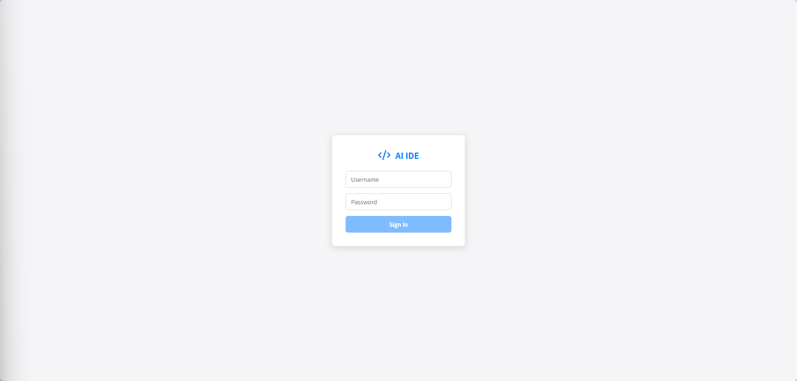
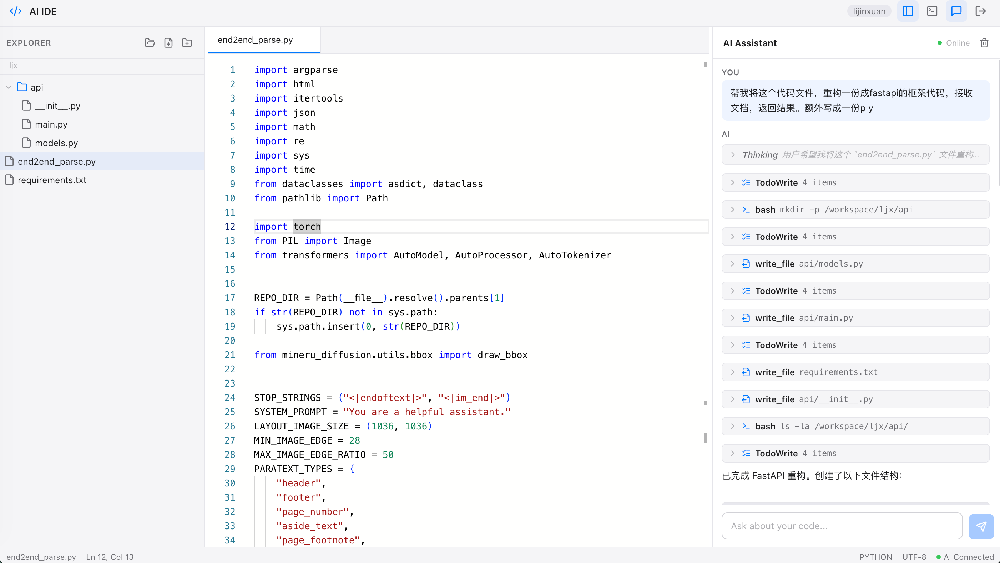

# AI IDE

> 当前版本：`v0.3.2`
>
> 发布时间：`2026-04-24`

完全离线、可私有化部署的 Web AI 集成开发环境，集代码编辑器、集成终端、AI 编程助手和多智能体协作于一体，一个 Docker 容器即可运行。

**无需联网，数据不出内网。** 接入任意 OpenAI 兼容的大模型（vLLM、Ollama、LocalAI 等），即可拥有完全自主可控的 Cursor / Windsurf 替代方案。

[English](README.md)




## 版本更新

### v0.3.2 · 2026-04-24

- 扩展 **Python 语义高亮**，新增多行赋值目标、`with` 别名、`for` 目标变量、`lambda` 参数、推导式绑定、`global` / `nonlocal`、`except*` 别名等场景
- 优化 **TypeScript / React / Vue** 的编辑器高亮体验，补充 Monaco 语义 token 和组件嵌入语法的主题映射
- 新增手动回归样例目录 [`docs/editor-samples/`](docs/editor-samples/README.md)，可直接打开检查 Python、TypeScript、React、Vue 的高亮效果

### v0.3.1 · 2026-04-23

- 扩展 **Ctrl/Cmd + 鼠标左键跳转**，增加基于工作区的定义查找路径，提升 Python、Vue、React 等跨文件跳转命中率
- 管理员设置页新增 **Max Tokens** 配置，可直接在界面中管理请求上限，无需手改环境变量
- 修复编辑器 **Ctrl/Cmd + S** 可能保存旧内容的问题，原因是 Monaco 动作持有了过期回调

### v0.3.0 · 2026-04-22

- 新增内置 **管理员设置页**，可直接在界面中新增用户、删除用户、重置密码，以及修改 LLM 的 URL / API Key / Model，且无需重启服务
- 左侧文件树新增 **文件 / 文件夹下载**，其中下载文件夹时会自动以 `.zip` 形式返回
- 左侧文件树新增 **批量删除**，支持多选后统一删除
- 编辑器新增 **Ctrl/Cmd + 鼠标左键跳转**，可在当前文件和已打开标签页中跳转到符号定义位置
- 修复 AI 回答中代码块 **Copy 按钮失效** 的问题，并增加剪贴板回退方案

## 版本说明

仓库现在开始以 GitHub 项目常见的轻量级更新记录方式维护版本说明。
`v0.3.2` 是当前 README 记录的最新版本，包含更完整的 Python 语义高亮、TypeScript/React/Vue 高亮优化，以及编辑器回归样例文件。

## 功能特性

- **100% 离线 & 私有化部署** — 运行时无需联网，所有数据留在你的基础设施内。适用于内网隔离环境、企业部署和敏感代码场景
- **兼容 OpenAI API** — 支持 vLLM、Ollama、LocalAI、DeepSeek、OpenAI 等任何 OpenAI 兼容接口，切换模型无需改代码
- **Monaco 代码编辑器** — 支持语法高亮、更完整的 Python 语义高亮、TypeScript/React/Vue 高亮优化、智能提示、多标签页，以及 Ctrl/Cmd 点击符号跳转
- **AI 编程助手** — 与 AI 智能体对话，它可以读取、编写、编辑文件，并在工作区内执行 Shell 命令
- **集成终端** — 基于 xterm.js 的全功能 PTY 终端，预装 Conda
- **文件浏览器** — 树形文件管理，支持新建、重命名、下载、批量删除、文件夹 zip 下载，以及"打开文件夹"功能（运行时切换工作区）
- **管理员设置页** — 可在界面中管理用户、重置密码，并配置 LLM 的 URL / API Key / Model / Max Tokens
- **多用户认证** — 登录页面支持用户名/密码认证，底层由 `users.json` 和内置管理员设置页共同管理；每个用户拥有独立会话（独立的工作区、终端、AI 上下文）
- **多智能体协作** — 可生成自主运行的 AI 队友，它们能认领任务、通过消息总线通信、并行工作
- **任务看板** — 创建、分配、跟踪跨智能体任务
- **Docker 就绪** — 多阶段构建，预装 Node.js、Python、Conda、Git 及常用开发工具

## 快速开始

### Docker 部署（推荐）

```bash
docker build -t ai-ide .

docker run -d --name ai-ide \
  -p 3000:3000 \
  -v ./workspace:/workspace \
  -v ./users.json:/app/users.json \
  -e VLLM_API_URL=http://your-llm-server:8000/v1 \
  -e VLLM_API_KEY=your-api-key \
  -e MODEL_NAME=your-model-name \
  ai-ide
```

或使用 Docker Compose：

```bash
# 编辑 docker-compose.yml，配置你的 LLM 端点
docker compose up -d
```

然后打开 http://localhost:3000 并登录。
使用管理员账号登录后，可以通过右上角 **Settings** 按钮管理用户并配置 LLM。

### Docker Compose

```yaml
services:
  ai-ide:
    build: .
    ports:
      - "3000:3000"
    volumes:
      - ./workspace:/workspace
      - ./users.json:/app/users.json  # 可选：覆盖用户配置
    environment:
      - VLLM_API_URL=http://host.docker.internal:8000/v1
      - VLLM_API_KEY=
      - MODEL_NAME=default
      - WORKSPACE_DIR=/workspace
      - MAX_AGENT_ITERATIONS=30
      - AGENT_MAX_TOKENS=8192
    restart: unless-stopped
    extra_hosts:
      - "host.docker.internal:host-gateway"
```

### 本地开发

```bash
# 后端
cd backend
npm install
WORKSPACE_DIR=../workspace npm run dev

# 前端（另开一个终端）
cd frontend
npm install
npm run dev
```

打开 http://localhost:5173（Vite 开发服务器会自动代理 API 请求到后端）。

本地开发模式下，通过管理员设置页保存的 LLM 配置默认会写入项目根目录的 `app-settings.json`。

### 编辑器高亮样例

如需快速做一次编辑器高亮回归检查，可以直接打开 [`docs/editor-samples/`](docs/editor-samples/README.md) 下的样例文件。当前样例覆盖 Python 语义绑定、TypeScript、React TSX 和 Vue `<script setup lang="ts">` 场景。

## 配置说明

### 环境变量

| 变量 | 默认值 | 说明 |
|------|--------|------|
| `VLLM_API_URL` | `http://host.docker.internal:8000/v1` | OpenAI 兼容的 API 地址 |
| `VLLM_API_KEY` | *（空）* | LLM 接口的 API Key |
| `MODEL_NAME` | `default` | 使用的模型名称 |
| `WORKSPACE_DIR` | `/workspace` | 默认工作区目录 |
| `PORT` | `3000` | 服务端口 |
| `MAX_AGENT_ITERATIONS` | `30` | 每次 AI 回复的最大工具调用轮数 |
| `AGENT_MAX_TOKENS` | `8192` | 每次 AI 回复的最大 Token 数 |
| `USERS_CONFIG` | *（自动检测）* | `users.json` 文件路径 |
| `APP_SETTINGS_CONFIG` | *（自动检测）* | 管理员设置页写入的 `app-settings.json` 路径 |

### 运行时配置文件

| 文件 | 作用 |
|------|------|
| `users.json` | 存储用户、密码、管理员标记和允许访问的工作区根目录 |
| `app-settings.json` | 存储管理员在界面中配置的 LLM URL、API Key、Model、Max Tokens 等运行时设置 |

如果你使用 Docker 并希望这些设置在重建容器后仍然保留，建议通过挂载文件或卷的方式持久化这两个配置文件。

### 用户管理

用户管理现在有两种方式：

- 推荐：使用管理员账号登录，在界面右上角 **Settings** 中直接新增用户、删除用户、重置密码
- 兼容方式：直接编辑项目根目录的 `users.json`，或编辑 `USERS_CONFIG` 指向的文件

`users.json` 示例：

```json
{
  "allowedRoots": ["/workspace", "/home"],
  "users": [
    { "username": "admin", "password": "admin123", "defaultWorkspace": "/workspace", "isAdmin": true },
    { "username": "alice", "password": "securepass", "defaultWorkspace": "/workspace/alice", "isAdmin": false }
  ]
}
```

| 字段 | 说明 |
|------|------|
| `allowedRoots` | 用户可通过文件夹浏览器打开的目录前缀白名单 |
| `username` | 登录用户名 |
| `password` | 登录密码 |
| `defaultWorkspace` | 登录后默认打开的工作区目录 |
| `isAdmin` | 是否拥有管理员设置页权限 |

如果你是在应用外手动编辑 `users.json`，需要重启后端后才会生效；如果是在管理员设置页中修改，则会立即生效。

### LLM 配置管理

LLM 运行时配置同样支持两种方式：

- 推荐：通过管理员设置页直接修改
- 兼容方式：通过环境变量 `VLLM_API_URL`、`VLLM_API_KEY`、`MODEL_NAME`、`AGENT_MAX_TOKENS` 指定

通过管理员设置页保存后，配置会写入 `app-settings.json`，新的 AI 请求会立即使用最新设置。

## 项目架构

```
ai-ide/
├── backend/                 # Express + WebSocket 服务端
│   └── src/
│       ├── agent/           # AI 智能体循环、工具、提示词、任务系统
│       │   ├── loop.ts      # LLM 调用循环及工具执行
│       │   ├── tools.ts     # 智能体工具（bash、文件读写、任务、队友）
│       │   ├── systemPrompt.ts
│       │   ├── taskManager.ts
│       │   ├── messageBus.ts
│       │   └── teammateManager.ts
│       ├── auth/            # 会话管理与中间件
│       ├── routes/          # REST API（文件操作、认证）
│       └── ws/              # WebSocket 处理（聊天、终端）
├── frontend/                # React + Vite 单页应用
│   └── src/
│       ├── components/      # Sidebar、Editor、ChatPanel、Terminal 等
│       └── hooks/           # useAuth、useChat、useFileSystem
├── users.json               # 用户凭证与允许路径配置
├── app-settings.json        # 管理员设置页持久化的 LLM 配置
├── Dockerfile               # 多阶段构建（Node + Conda + 开发工具）
└── docker-compose.yml
```

### 技术栈

| 层级 | 技术 |
|------|------|
| 编辑器 | Monaco Editor |
| 终端 | xterm.js + node-pty |
| 前端 | React 18、Vite、TypeScript |
| 后端 | Express、WebSocket (ws)、TypeScript |
| AI | OpenAI 兼容 API（工具调用智能体循环） |
| 运行时 | Node.js 20、Python 3、Miniconda |

## AI 智能体能力

AI 助手可以：

- **读取 / 编写 / 编辑文件** — 直接操作工作区内的文件
- **执行 Shell 命令** — 通过集成终端运行命令
- **管理任务** — 创建、更新、跟踪任务看板
- **生成队友** — 创建具有特定角色的自主 AI 子智能体
- **协作** — 智能体之间通过消息总线通信，可主动认领任务

### 智能体工具列表

| 工具 | 说明 |
|------|------|
| `bash` | 执行 Shell 命令（危险操作已屏蔽） |
| `read_file` | 读取文件内容 |
| `write_file` | 创建或覆盖文件 |
| `edit_file` | 在现有文件中查找替换 |
| `TodoWrite` | 更新对话中的任务清单 |
| `task_create` | 创建持久化任务 |
| `task_update` | 更新任务状态 |
| `spawn_teammate` | 启动自主运行的 AI 队友 |
| `send_message` | 向指定队友发送消息 |
| `broadcast` | 向所有活跃队友广播消息 |

## 许可证

MIT
